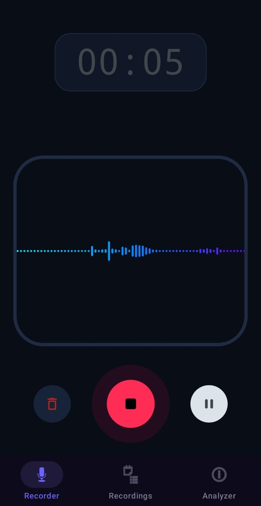
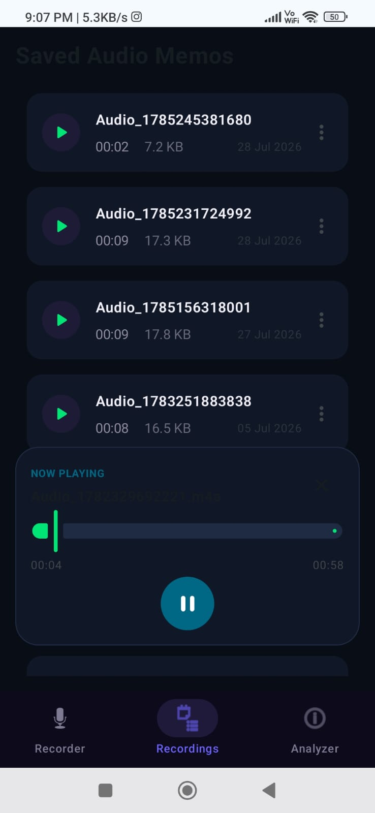
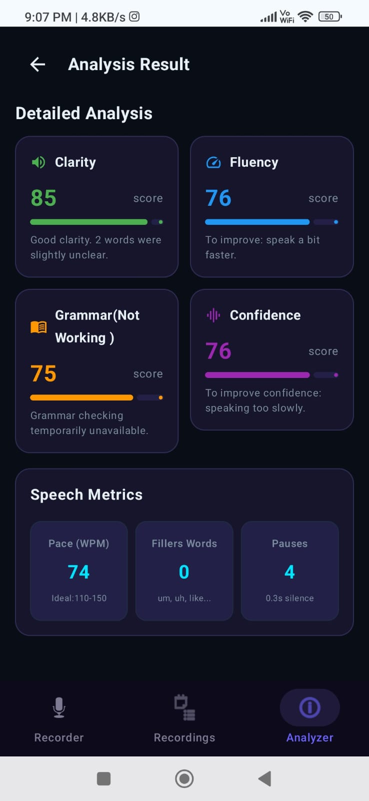
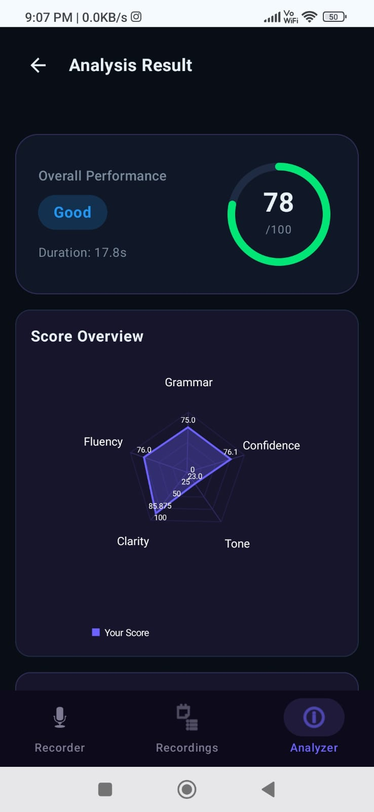

# 🎙️ VoiceAnalyzer 

   

VoiceAnalyzer is an AI-powered Android application built with **Kotlin** and **Jetpack Compose** that records speech, plays back audio recordings, visualizes waveforms in real time, and analyzes clarity, fluency, grammar, confidence, and emotional tone using a cloud-based speech analysis service.

## 🚀 Highlights
- 🎙️ Real-time voice recording
- ▶️ Built-in audio player with seek controls
- 🌊 Live waveform visualization
- 🧠 AI-powered speech and emotion analysis
- 📊 Radar chart and performance insights
- 📝 Automatic speech-to-text transcription
- 💾 Offline history with Room database

## 📱 Screenshots

<table>
  <tr>
    <td></td>
    <td></td>
  </tr>
  <tr>
    <td></td>
    <td></td>
  </tr>
</table>

## ✨ Features

### 1. 🎙️ Real-time Audio Recorder
*   **Acoustic Wave Visualizer:** Custom Canvas-drawn waveform that responds instantly to voice amplitude.
*   **Intuitive Controls:** Simple mic recording trigger, visual pause/resume controls, and a discard option.
*   **Pulsing Alert Glows:** High-fidelity micro-animations indicating active recording states.

### 2. 🗃️ Memo Library & MiniPlayer
*   **Organized Archive:** Lists all saved audio tracks with metadata, including exact duration, file size, and recording date.
*   **Floating MiniPlayer:** Dynamic, glassmorphic player overlay with a seek slider, pause/resume control, and swipe-to-dismiss support.
*   **Management Actions:** Instantly rename or delete recordings directly from the library dropdown.

### 3. 🧠 Voice & Speech Analysis (AI-Powered)
Sends recorded audio to a cloud microservice (`/analyze` endpoint) to generate a detailed vocal profile:
*   **Circular Performance Gauge:** Radial overall performance score (0-100) and grade badge.
*   **Voice Overview Radar Chart:** Multi-dimensional visualization of **Clarity, Fluency, Grammar, Confidence, and Tone** (built with `MPAndroidChart`).
*   **Emotional Tone Classification:** Analyzes voice characteristics to classify tone (e.g., *Confident, Enthusiastic, Hesitant, Monotone, Nervous, Neutral*) and provides suggestions for improvement.
*   **Speech Metrics Breakdown:** Measures pace (Words Per Minute), counts filler words (*um, uh, like...*), and tracks silent pauses.
*   **Speech-to-Text:** Whisper (small) model, self-hosted on Google Cloud for audio transcription.


### 4. 🗄️ Offline Cache & History
*   **Room Database integration:** Automatically saves analysis results locally.
*   **History Logs:** Browse, revisit, or delete past analyses offline from the history dashboard.

## 🛠️ Architecture & Tech Stack

VoiceAnalyzer is engineered following modern Android architecture recommendations:

*   **Architecture Pattern:** MVVM (Model-View-ViewModel) + Repository Pattern.
*   **UI Framework:** Jetpack Compose (Declarative UI layout).
*   **Local Caching:** Room Database (SQLite abstraction for offline history data).
*   **Network Client:** Retrofit 2 + Gson Converter + OkHttp (Supports multipart audio uploads and long-running analysis requests).
*   **Data Flow:** Kotlin Coroutines & StateFlow (Ensures reactive UI updates).
*   **Charts & Visuals:** `MPAndroidChart` (Interoperable Radar Chart) + Custom Drawing (`Canvas`).
*   **Speech-to-Text:** OpenAI Whisper (small model) for audio transcription.

---

## 📂 Project Structure

```
com.example.voiceanalyzer
├── Data
│   ├── Local          # Room database (Database.kt, DAO.kt, entities, and type converters)
│   ├── Media          # Audio recording/playback managers & repositories
│   └── Remote         # Retrofit clients & API interfaces for cloud voice analysis
├── ViewModel          # Screen ViewModels (Recorder, Recording list, and Analyzer ViewModels)
├── ui
│   ├── Navigation     # Navigation routing (Screen definition & NavHost config)
│   ├── Screens        # Composable Screens (RecorderScreen, RecordingsScreen, AnalyzerScreen)
│   └── theme          # Custom styling tokens (Color, Type, Theme, and MiniPlayer composable)
└── MainActivity.kt    # Entrypoint host activity
```

---

## 📚 What I Learned

*   **Building Complex UIs with Jetpack Compose:** Designing custom layouts, cards, and interactive visual components dynamically.
*   **Managing State Using StateFlow:** Harnessing unidirectional data flow (UDF) to propagate repository states smoothly to the UI.
*   **Recording and Processing Audio on Android:** Implementing media capture flows using `MediaRecorder` and `MediaPlayer` APIs correctly.
*   **Integrating REST APIs with Retrofit and OkHttp:** Handling multi-part file uploads and configuring robust request timeouts for heavy processing.
*   **Storing Offline Data Using Room:** Structuring SQLite schemas, type converters, and DAOs to establish offline-first storage mechanics.
*   **Drawing Custom Visualizations with Canvas:** Engineering real-time wave visualizers using drawing coordinates mapped from sound amplitudes.
*   **Creating Responsive Dark-Themed UI:** Devising clear color systems to guarantee high contrast and visually appealing layouts.

---

## 🔮 Future Work

*   **Grammar Precision:** Refactoring and improving the grammar analysis module to capture finer nuances of language structure.
*   **Pronunciation Assessment:** Implementing phoneme-level pronunciation checks to provide detailed phonetics feedback.

---

## 🚀 Getting Started

### Prerequisites
*   **Android Studio** (Koala or newer recommended).
*   **JDK 17** configured in build settings.
*   An Android device or emulator running **API 26 (Android 8.0)** or higher.

### Building & Running
1. Clone the repository:
   ```bash
   git clone https://github.com/DipankarBisht/VoiceAnalyzer.git
   ```
2. Open the project in Android Studio.
3. Sync Gradle and build the project.
4. Run the app on your device/emulator.

---

## 📡 API Reference

VoiceAnalyzer communicates with a server hosting the analysis engine:
*   **Base URL:** [Configured via local.properties or BuildConfig]
*   **Endpoint:** `/analyze` (`POST`, Multipart)

#### Request payload:
```http
POST /analyze HTTP/1.1
Content-Type: multipart/form-data

file: [Audio File Binary - .m4a/.mp3]
```

#### JSON Response schema (`Analysis_data`):
```json
{
  "overall_score": 85.0,
  "overall_grade": "Excellent",
  "duration_seconds": 12.4,
  "transcription": "Hello this is a test recording...",
  "emotional_tone": {
    "tone": "Confident",
    "confidence": 0.92,
    "suggestion": "Keep up the energetic pacing and firm intonation."
  },
  "clarity": { "score": 90.0, "feedback": "Great pronunciation..." },
  "fluency": {
    "score": 88.0,
    "wpm": 130.0,
    "filler_count": 2,
    "pause_count": 1,
    "feedback": "Consistent rhythm..."
  },
  "grammar": { "score": 85.0, "feedback": "Grammatically sound..." },
  "confidence": { "score": 92.0, "feedback": "Excellent pitch projection..." }
}
```

---

## ⚠️ Disclaimer

This application uses cloud-based AI models to analyze audio data. The results, including clarity scores, grammar suggestions, confidence scores, and emotional classifications, are for feedback and educational purposes only and should not be treated as professional speech diagnostic assessments.
